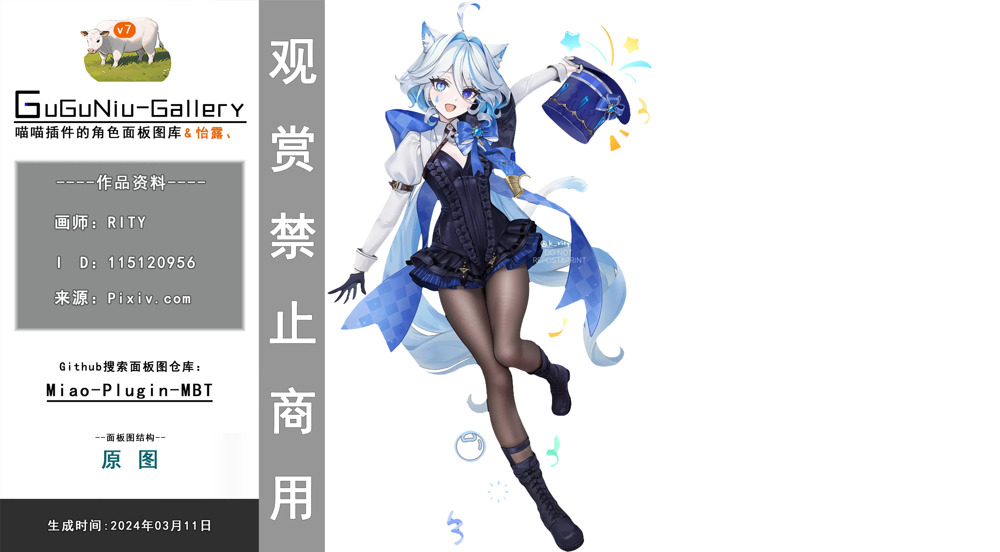

<p align="center">
  <a href="https://github.com/GuGuNiu/Miao-Plugin-MBT">
    
  </a>
</p>
<p align="center">
  <a href="https://github.com/GuGuNiu/Miao-Plugin-MBT"></a>
  <a href="https://github.com/GuGuNiu/Miao-Plugin-MBT"></a>
  <a href="https://github.com/GuGuNiu/Miao-Plugin-MBT/stargazers"></a>
  <a href="https://github.com/GuGuNiu/Miao-Plugin-MBT/issues"></a>
</p>
<p align="center">
  <a href="https://github.com/GuGuNiu/Miao-Plugin-MBT">
    
  </a>
</p>

# 前言

**咕咕牛的图库 (GuGuNiu Gallery)** 是Yunzai下的面板图扩展，提供角色面板图资源并内置强大的管理系统，旨在为提供稳定流畅且安全的图库体验。管理器已做到了95%的场景无人值守的自主运维，操作、流程、智能自动化基本无需人工介入干预，面对复杂的**GitHub**访问环境，管理器内置了动态智能加速机制，包括：**多节点Git + HTTP双通道智能测速、故障自动切换、多节点竞速下载、代理失效降级重试、双层下载模式**等一整套容灾策略

面板图自2025年起不再使用**人工抠图**了，图库已采用付费方式全套使用 **[ Liblib 工作流 + Adobe云 ]** 全自动抠图，部分全屏图采用 **Midjourney** 扩图，完成前面操作后进行人工调色，对每张面板图绝不将就尽可能适配每个角色元素的背景和每个插件的渲染效果，让面板图融入其中。全付费内容由咕咕牛自掏腰包，本图库无任何赞助/爱发电，请勿上当了。 

- **已完美兼容 `Miao-Plugin`、`ZZZ-Plugin` 及 `Waves-plugin`插件。**
- 提供了 **原神、崩坏：星穹铁道、绝区零、鸣潮** 的面板图库资源。
- **支持角色名与别名的模糊匹配，并采用多层的高性能内存索引秒级响应。**


## ⚠️ 使用须知

-   本项目除**图片资源**外基于MIT协议开源，**严禁用于任何商业用途,图片版权归属原作者**。
-   图库资源均收集自公开网络，**版权归原作者所有**。如内容涉及侵权，请立即联系删除。


## 🛡️ 净化等级与内容过滤

> [!WARNING]
> 为了应对潜在的平台风控，咕咕牛提供了一套内容净化系统，建议根据自身需求配置。

使用指令 `#咕咕牛设置净化等级 <等级>` 来调整，等级定义如下：

| 等级 | 效果       | 详细说明                                         |
|:----:|:-----------|:-------------------------------------------------|
| **0**  | **无过滤**   | 显示所有图片，风险自负。                         |
| **1**  | **常规净化** | 过滤 R18 内容，但保留部分低风险的暗示性图片 (Px18)。 |
| **2**  | **最高净化** | 过滤所有被标记为 R18 和 Px18 的敏感内容。           |

支持你的个性化的图片管理如 **#咕咕牛封禁/解禁xx**<br>
此外还可通过 `#咕咕牛设置` 指令对 **AI生成图、彩蛋图、横屏图** 进行独立开关。

<details>
<summary>[每种标签Tag的详细说明介绍]</summary>
  
-   **Px18**: 指轻微性暗示或低度挑逗性图片，无关键部位裸露。
-   **Rx18**: 指存在关键部位刻意裸露或具有高度挑逗性的图片。
-   **Ai图**：由Ai制作的图片
-   **彩蛋图**：由图库内置的自控彩蛋非各插件的彩蛋逻辑
-   **横屏图**：全屏铺满的面板图
    
</details>


### ⚙️ 负载均衡

管理器提供两种运行模式，可通过 `#咕咕牛设置低负载 [开启|关闭]` 切换：
> [!IMPORTANT]
> 特别提醒：开启后若长时间处在高压状态则会马上释放任务并自动关闭低负载
> 
<details> <summary>[🫵点击展开看看具体内容吧🫵]</summary>
  
-  **举例**:花火 80张在以下不同模式的处理速度:
-   **高速模式 (默认)**: 并发处理任务响应最快(1s-3s)
-   **低负载模式**: 串行处理任务牺牲部分速度(5s-10s)

在**低负载模式**下，你还可以通过 `#咕咕牛设置负载等级 [1-3]` 调整防御策略的严格程度：

| 等级 | 名称 | 效果                                           |
|:----:|:-----|:-----------------------------------------------|
| **1**  | **标准** | 提供适度的指令冷却和资源监控。                 |
| **2**  | **保守** | 更长的冷却时间和更敏感的资源监控。             |
| **3**  | **极致** | 最严格的策略，最大限度防止机器人卡顿或崩溃。   |
</details>

## 🧩 第三方图库支持

- 支持从 **GitHub、Gitee、GitCode、Gitea** 平台克隆并自动探测仓库内的文件夹结构
- **示例**: `#咕咕牛安装https://github.com/user/repo:我哈`

> [!NOTE]
> Github源将会调用内置的高级下载器,不过如果仓库过大比如超过800MB那么失败概率就很高了,那么从咕咕牛安装的图库管理逻辑肯定也是按照咕咕牛的，有需要的话可以让仓库作者联系咕咕牛单独适配下

<details> <summary>[🫵点击展开看看具体内容吧🫵]</summary>
  
| 指令                                 | 效果                                |
|:-------------------------------------|:------------------------------------|
| `#咕咕牛安装 <URL:简称>`                 | 安装第三方图库 |
| `#咕咕牛更新 <简称\|全部>`               | 更新指定的或全部第三方图库     |
| `#咕咕牛卸载 <简称>`                     | 卸载第三方图库及其所有文件     |
| `#咕咕牛列表`                          | 展示所有已安装的第三方图库     |
</details>


---

## 🤔 常见问题 (Q&A)

-   **Q: 部分仓库下载失败怎么办？**
    -   **A:** 管理器支持断点续传。只需再次发送 `#下载咕咕牛`，即可继续未完成的下载任务。

-   **Q: 管理器Js报错或运行不正常？**
    -   **A:** 先尝试重启，也可从仓库拉一份最新的Js然后重新覆盖，或者请携带由 AI 生成的错误报告图前往 Issues 反馈。
     
-   **Q: 更新图库后，看不到新面板图？**
    -   **A:** 索引数据未更新导致的，所有操作都会依据imagedata.json，索引数据不会及时更新。

---

## 🎨 界面一览

<p align="center">
  <i>咕咕牛图库管理器全新的UX/UI 2.0界面预览</i>
  <br><br>
  
</p>

<p align="center">
  


</p>
  <i>水印说明：在保障原图作者利益和咕咕牛图库权益的前提下,每张面板图都会带有标识信息的水印,介意请勿安装</i>
  
---


## 安装管理器

在**Yunzai**项目**根目录**下，打开终端并执行以下任一指令：

**✅ 主源 (Jsdelivr CDN)**
```bash
curl -o "./plugins/example/咕咕牛图库管理器.js" -L "https://cdn.jsdelivr.net/gh/GuGuNiu/Miao-Plugin-MBT@main/咕咕牛图库管理器.js"
```

**☑️ 备用源 (GitHub Raw 代理)**
```bash
curl -o "./plugins/example/咕咕牛图库管理器.js" -L "https://github.moeyy.xyz/https://raw.githubusercontent.com/GuGuNiu/Miao-Plugin-MBT/main/咕咕牛图库管理器.js"
```

> [!TIP]
> 部署插件后 输入 **#咕咕牛帮助** 查看命令，输入 **#下载咕咕牛** 安装图库 。

---

## 💐 特别鸣谢

感谢以下平台为本图库提供丰富的图片资源：
[Pixiv](https://www.pixiv.net/) · [Arca.live](https://arca.live) · [小红书](https://www.xiaohongshu.com/explore) · [NGA](https://nga.178.com/) · [X (Twitter)](https://x.com)

## 📦 仓库分流

为提升下载速度和稳定性，图库资源分散在多个 GitHub 仓库中。
<details> <summary>展开看看？</summary>
  
<p align="center">
  <a href="https://github.com/GuGuNiu/Miao-Plugin-MBT"></a>
  <a href="https://github.com/GuGuNiu/Miao-Plugin-MBT-2"></a>
  <br>
  <a href="https://github.com/GuGuNiu/Miao-Plugin-MBT-3"></a>
  <a href="https://github.com/GuGuNiu/Miao-Plugin-MBT-4"></a>
</p>

</details>


