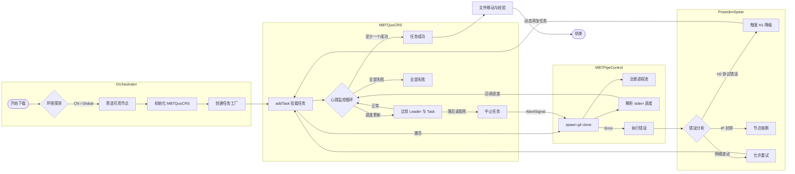

<p align="center">
  <a href="https://github.com/GuGuNiu/Miao-Plugin-MBT">
    
  </a>
</p> 

### 图库的介绍

  面板图采用 `Nano-Banana-Pro`、`Comfyui` 等工具进行二次调色与扩图处理。在确保质量优先的前提下，定期替换不符合当前审美的旧图，避免无序扩张。管理器提供多元化的图片管理方案，全面支持 [原神/星铁] Miao-Plugin、[绝区零] ZZZ-Plugin、[鸣潮] Waves-Plugin（0卡苏打水版）。🏵️  **2023年10月** 创立以来，持续打磨便捷且安全的 **"一体化面板图库生态"** 体验
  <a href="https://qm.qq.com/q/cyXMqRBzY6" target="_blank" style="text-decoration: none;">
    <button style="
      padding: 10px 20px;
      font-size: 16px;
      font-weight: bold;
      color: white;
      background: linear-gradient(to right, #00aaff, #0077ff);
      border: none;
      border-radius: 8px;
      cursor: pointer;
      box-shadow: 0 2px 8px rgba(0, 0, 0, 0.1);
      transition: background 0.3s ease;
    " onmouseover="this.style.background='linear-gradient(to right, #0099dd, #0055dd)'" 
       onmouseout="this.style.background='linear-gradient(to right, #00aaff, #0077ff)'">
      💬 QQ群：留学移民交流群
    </button>
  </a>🏵️

管理器插件采用基于 **Symbol 索引的全局事件总线架构**，核心底座 `SignalTrap` 继承自 `EventEmitter`，利用 `Symbol.for` 在全局作用域注册唯一实例（跨热重载持久化），作为**中央事件总线**，通过 **EventListener** 统一接管信号与生命周期事件，驱动模块协同。

| 核心模块 | 实现 | 架构职责 |
| :--- | :--- | :--- |
| **SignalTrap** | `EventEmitter` + `Symbol` | **全局事件总线**。利用 Symbol 确保实例唯一，监听 OS 信号并广播事件，是插件的生命周期锚点。 |
| **ProcPool** | `EventListener` | **进程生命周期管理**。订阅 Trap 的事件，在插件重载或关闭时，自动捕获并销毁所有挂起的子进程。 |
| **QuoCRS** | `AbortController` + `Listener` | **并发任务调度底座**。监听上游信号与 Trap 事件，负责异步任务队列的竞态控制、熔断保护与中止。 |

<p>
  
</p>

### ⚠️ 使用须知 · 请务必仔细阅读

- **部分图片为付费商业素材**，**图片资源严禁用于任何商业用途**。如有侵权请联系删除。
- 咕咕牛已购买此素材仅用于展示用途，咕咕牛不拥有其版权**后续使用或传播行为与本项目无关**。

---

## 内容净化与过滤系统

> [!WARNING]
> 为应对潜在的封号威胁建议根据自身需求配置，此功能是贯穿全图库业务的核心优先级最高请着重考虑！

| 等级 | 效果         | 说明                                              |
|:----:|:-------------|:--------------------------------------------------|
| 0    | 无过滤       | 显示所有面板图，含敏感内容 ( 轻微露点占比0.02% )        |
| 1    | 常规净化     | 过滤全部 Rx18，保留低敏感的 Px18 内容                   |
| 2    | 最高净化     | 严格过滤所有敏感内容（含 Rx18 + Px18）            |
| SR18 | 性张力展示   | 包含了各种以及边缘性趣味的玩法内容，限制级较高 |

配合以下指令可独立管理图片类型开关：
- #咕咕牛设置 AI图 / 彩蛋图 / 横屏图 ```启|禁用```
- #咕咕牛封禁 / 解禁 ```角色名``` | ```[二级标签]```
- #咕咕牛设置SR18 ```启|禁用```

> [!TIP]  
> [二级标签] 作为可选参数用于更精确的封禁管理，如 #咕咕牛封禁 黑丝 将会封禁所有黑丝相关的图片并且会优先遵循上层过滤等级，使用 #咕咕牛查看 指令查询二级标签信息

<details>
<summary>📌 更多标签说明</summary>

- **P18**：轻微暗示，未暴露关键部位
- **R18**：暴露明显，尺度较大
- **SR18**：无尺
- **AI图**：由 AI 画图大模型生成
- **彩蛋图**：咕咕牛内置逻辑，与各个插件无关
- **横屏图**：横向全屏的面板图 [如果你使用了自己改的背景图那么建议还是关闭横屏图不然会非常的突兀]

</details>

---

## 社区面板图库的支持

> [!NOTE]
> 咕咕牛提供了对Yunzai框架下的插件完整的垂直适配，在©️ v5.2.0版本提供了多模态的下载器，可以让你更加专注提供内容，可在issues反馈你的仓库地址加入到一键安装列表中，管理器在每个星期都会自动更新社区图库。

- 支持从 **GitHub、Gitee、GitCode、Gitea** 平台克隆并自动探测仓库内的文件夹结构
- **示例**: `#咕咕牛安装https://github.com/user/repo:我哈`


### 🅰️ 社区图库指令表
  
| 指令                                 | 效果                                |
|:-------------------------------------|:------------------------------------|
| `#咕咕牛安装 <URL:简称>`                 | 安装社区图库 |
| `#咕咕牛更新 <简称\|全部>`               | 更新指定的或全部社区图库     |
| `#咕咕牛卸载 <简称>`                     | 卸载社区图库及其所有文件     |
| `#咕咕牛列表`                          | 展示所有已安装的社区图库     |

### 🅱️ 社区图库的内容过滤管理 ```©️ v5.2.1 实装```

| 指令                                 | 效果                                |
|:-------------------------------------|:------------------------------------|
| `#咕咕牛封/解禁芙芙<CID>`                 | 封/解禁指定图库的指定面板图 |
| `#咕咕牛过滤列表`                 | 展示已安装图库封禁情况 |

</details>

---

## 图库界面展示

<p align="center">
  <i>咕咕牛图库管理器全新 UX/UI 2.0 界面预览</i>
  <br><br>
  
</p>

<p align="center">
  
</p>

<i>水印说明：在保障原图作者利益和咕咕牛图库权益的前提下,每张图都会带标识信息水印,介意请勿安装</i>

---

## 安装方式

在 Yunzai 根目录执行以下任一命令安装管理器：

**✅推荐：JsDelivr CDN**
```bash
curl -o "./plugins/example/咕咕牛图库管理器.js" -L "https://cdn.jsdelivr.net/gh/GuGuNiu/Miao-Plugin-MBT@main/咕咕牛图库管理器.js"
````

> [!TIP]
> 部署插件后输入 **#咕咕牛帮助** 查看命令，输入 **#下载咕咕牛** 安装图库自动启用。 <br>
> 你至少需要准备 Nodejs 22 版本以上，否则会报错。

---

## 项目透明墙

> 以下对"数字资产所有者"，"面板图二次创作使用来源“，"图片原创者"，"数字影像所有者"统称为**原创者**

<table border="1" style="width: 100%; table-layout: fixed;">
  <tr>
    <th>模块/功能</th> 
    <th>具体说明</th>
  </tr>
  <tr>
    <td>远程封禁</td> 
    <td><strong>远程封禁模块/功能</strong>仅用于保障<strong>“原创者“</strong>的版权追溯，<br>
    <strong>远程封禁模块/功能</strong>不涉及任何 <strong>后门</strong>，咕咕牛仅作为协助<strong>暂停图像分发</strong>，<br>
    任何行为应遵循<strong>“原创者“</strong>当地法律，咕咕牛不承担因此产生的任何<strong>法律责任</strong>。</td> 
  </tr>
  
  <tr>
    <td style="white-space: nowrap;">树复制</td> 
    <td>以下对该模块/功能简称<strong>"资源同步":</strong> <br>
     <strong>资源同步模块/功能</strong>仅用于保障<strong>“原创者“</strong>的版权追溯清理遗留在用户本地的图片文件，<br>
  </tr>

</table>

## 🍵 开发资料 & 杂谈

<details> <summary> 🫳 1.  并发调度研究 </summary> 


```mermaid
graph LR

subgraph Orchestrator ["Orchestrator"]
    O_Start([开始下载])
    O_EnvCheck{环境探测}
    O_NodeSelect[筛选可用节点]
    O_InitCRS[初始化 MBTQuoCRS]
    O_TaskFactory[创建任务工厂]

    O_Start --> O_EnvCheck
    O_EnvCheck -->|CN / Global| O_NodeSelect
    O_NodeSelect --> O_InitCRS
    O_InitCRS --> O_TaskFactory
end

subgraph Scheduler ["MBTQuoCRS"]
    S_AddTask[addTask 挂载任务]
    S_Monitor{心跳监控循环}
    S_Compare[比较 Leader 与 Task]
    S_Kill[中止任务]
    S_Success[任务成功]
    S_Fail[全部失败]

    S_AddTask --> S_Monitor
    S_Monitor -->|进度更新| S_Compare
    S_Compare -->|落后或假死| S_Kill
    S_Compare -->|正常| S_Monitor
    S_Monitor -->|至少一个成功| S_Success
    S_Monitor -->|全部失败| S_Fail
end

subgraph Executor ["MBTPipeControl"]
    E_Spawn[spawn git clone]
    E_ProcPool[注册进程池]
    E_Parse[解析 stderr 进度]
    E_Error[执行错误]

    S_AddTask -->|激活| E_Spawn
    E_Spawn --> E_ProcPool
    E_Spawn --> E_Parse
    E_Spawn -->|Error| E_Error
end

subgraph Analyzer ["PoseidonSpear"]
    A_Analyze{错误分析}
    A_Downgrade[触发 H1 降级]
    A_Break[节点熔断]
    A_Retry[允许重试]

    E_Error --> A_Analyze
    A_Analyze -->|H2 协议错误| A_Downgrade
    A_Analyze -->|IP 封禁| A_Break
    A_Analyze -->|网络波动| A_Retry
    A_Downgrade -->|动态添加任务| S_AddTask
    A_Retry --> S_AddTask
end

O_TaskFactory --> S_AddTask
E_Parse -->|回调进度| S_Monitor
S_Kill -->|AbortSignal| E_Spawn
S_Success --> F_FileOps[文件移动与校验]
F_FileOps --> F_End([结束])

```

### 主架构联动性

#### 1. Quo -> Pipe -> Pool (清理链)
- `CRS` 决定淘汰 -> `controller.abort()`。
- `MBTPipeControl` 捕获 `abort` -> 发送 `SIGTERM` 给子进程。
- 子进程退出 -> 触发 `exit` 事件。
- `MBTQuoCRS` 监听到 `exit` -> 从 `pool` 中移除引用。
- **闭环完成**。

#### 2. Smart -> Quo (调度链)
- `SmartTaskHeavy` 使用 `delayAcc` -> `CRS` 收到 `delay` -> `setTimeout` -> 挂载任务。
- **并发风暴解决**：`节点A` 先跑 6秒，建立连接后，`节点B` 再启动。

#### 3. Smart -> Quo (补员链)
- `SmartTaskHeavy` 的 `setInterval` 监控 `CRS.getStatus()`。
- 发现 `activeCount < 2` -> 从 `reserveNodes` 取出新节点 -> `CRS.addTask`。
- **饥饿问题解决**：即使开局两个节点挂了一个，替补队员会立即上场，保持场上始终有竞争压力。
  
</details>

<details>
<summary> 🫳 2. CRS / Pipe 采样模型 </summary>

### 动态权重评估模型

- **CRS 周期**：2000 ms  
- **Pipe 脉冲**：5000 ms  

**风险说明：**

在 `T = 4.9 s` 时，CRS 读取的是 `T = 0 s` 的遥测数据（已过期 4.9 s）。  
如果网络在 `T = 1 s` 时断开，CRS 仍会误判连接健康并维持任务，额外浪费约 3 s 的时间窗口。

---

### 修正算法

在计算动态权重时，引入 **时间衰减因子**，用于抑制过期遥测数据对决策的影响。

#### 权重公式

```text
Score = (W_p × P) + (W_t × T_norm × F_decay)
````

**参数说明：**

* `P`：业务进度（0–100）

* `T_norm`：归一化吞吐量

  ```text
  T_norm = min(Speed / 5MB/s, 1.0) × 100
  ```

* `F_decay`：新鲜度衰减因子（基于遥测时间戳）

  * `now - last_tick < 3000 ms` → `F_decay = 1.0`
  * `now - last_tick > 5000 ms` → `F_decay = 0.0`
    （数据视为过期，等效为 0 流量）

</details>

## 收纳柜

<details> <summary> 🌏 CowCoo Web控制台 </summary>

<br>
  
-   **Q: 启动机器人或更新后，依赖安装失败的报错怎么办？**
    -   **A:** 因为 Web 控制台 GuTools 的依赖未能自动安装，通常PNPM异常导致，你可以在GuTools下打开终端运行`pnpm install` 尝试解决

  
<br>
通过 #咕咕牛登录 获取控制台的入口地址，更精细化、可视化的操作，当你在群聊内发送登录公网IP会主动被隐藏。但是WEB端本质上是方便我自己编辑索引数据没什么好用的。

>需要你的服务器打开端口：31540


</details>

<p align="center">
  <a href="https://github.com/GuGuNiu/Miao-Plugin-MBT"></a>
  <a href="https://github.com/GuGuNiu/Miao-Plugin-MBT"></a>
  <a href="https://github.com/GuGuNiu/Miao-Plugin-MBT/stargazers"></a>
  <a href="https://github.com/GuGuNiu/Miao-Plugin-MBT/issues"></a>
</p>


<p align="center">
  <a href="https://github.com/GuGuNiu/Miao-Plugin-MBT">
    
  </a>
</p>
